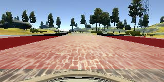
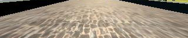
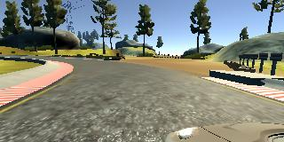
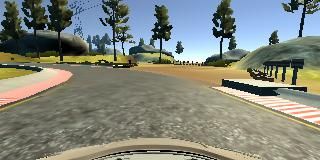
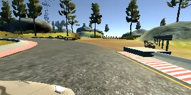

# Behaviorial Cloning Project

Overview
---
This project uses a modified version of [Nvidia's Architecture](https://devblogs.nvidia.com/parallelforall/deep-learning-self-driving-cars/) to train a model to clone driving behavior. The model is built using Keras. The model uses left, center and right camera cropped images, applies steering correction factor, uses image flip technique to augment the data. The model is trained with small number of epochs, to avoid overfitting.

### Dependencies
This lab requires:

* [CarND Term1 Starter Kit](https://github.com/udacity/CarND-Term1-Starter-Kit)

The lab enviroment can be created with CarND Term1 Starter Kit. Click [here](https://github.com/udacity/CarND-Term1-Starter-Kit/blob/master/README.md) for the details.

* [Linux Simulator Link](https://d17h27t6h515a5.cloudfront.net/topher/2017/February/58ae46bb_linux-sim/linux-sim.zip)

### Files Submitted & Code Quality

#### 1. Submission includes all required files and can be used to run the simulator in autonomous mode

My project includes the following files:
* model.py containing the script to create and train the model
* drive.py for driving the car in autonomous mode
* model.h5 containing a trained convolution neural network 
* writeup_report.md or writeup_report.pdf summarizing the results

#### 2. Submission includes functional code
Using the Udacity provided simulator and my drive.py file, the car can be driven autonomously around the track by executing 
```sh
python drive.py model.h5
```
### Model Architecture and Training Strategy
#### 1. Using Single Layer Model

I tried a single layer model to verify if everything is working. The single layer model input is shown as follows
```
model = Sequential()
model.add(Cropping2D(cropping=((70,25),(0,0)),input_shape=(row, col, ch)))
model.add(Lambda(lambda x: x/127.5 - 1.))
model.add(Flatten())
model.add(Dense(1))
model.summary()
model.compile(loss='mse', optimizer='adam',metrics=['accuracy'])
model.fit(X_train, y_train, validation_split=0.2, shuffle=True, nb_epoch=2)
model.save('model.h5') #save the model
```

#### 1. Single Layer Model Output

```
Using TensorFlow backend.
____________________________________________________________________________________________________
Layer (type)                     Output Shape          Param #     Connected to                     
====================================================================================================
cropping2d_1 (Cropping2D)        (None, 65, 320, 3)    0           cropping2d_input_1[0][0]         
____________________________________________________________________________________________________
lambda_1 (Lambda)                (None, 65, 320, 3)    0           cropping2d_1[0][0]               
____________________________________________________________________________________________________
flatten_1 (Flatten)              (None, 62400)         0           lambda_1[0][0]                   
____________________________________________________________________________________________________
dense_1 (Dense)                  (None, 1)             62401       flatten_1[0][0]                  
====================================================================================================
Total params: 62,401
Trainable params: 62,401
Non-trainable params: 0
____________________________________________________________________________________________________
Train on 38572 samples, validate on 9644 samples
Epoch 1/2
38572/38572 [==============================] - 24s - loss: 1.1026 - acc: 0.0734 - val_loss: 4.1483 - val_acc: 0.0362
Epoch 2/2
38572/38572 [==============================] - 23s - loss: 1.5817 - acc: 0.0633 - val_loss: 2.0330 - val_acc: 0.0555
```
The single layer model has high validation loss and very small validation accuracy. The car doesn't stay on road while in autonomous mode. 
But this architecture helps in confirming that all prerequisites are met. 

#### 2. Using LENET Architecture 
The next architecture used was LENET, since LENET is a very first convolutional architecture developed to recognize characters 


Fig. shows the flow of LENET Arch [1]

```
model = Sequential()
# Preprocess incoming data, centered around zero with small standard deviation
model.add(Cropping2D(cropping=((70,25),(0,0)),input_shape=(row, col, ch)))
model.add(Lambda(lambda x: x/127.5 - 1.))
model.add(Convolution2D(6,5,5,activation="relu"))
model.add(MaxPooling2D())
model.add(Convolution2D(6,5,5,activation="relu"))
model.add(MaxPooling2D())
model.add(Flatten())
model.add(Dense(120))
model.add(Dense(84))
model.add(Dense(1))
model.summary()
model.compile(loss='mse', optimizer='adam',metrics=['accuracy'])
model.fit(X_train, y_train, validation_split=0.2, shuffle=True, nb_epoch=1)
model.save('model_3.h5')
```
#### 2. LENET Model Output
```
Using TensorFlow backend.
____________________________________________________________________________________________________
Layer (type)                     Output Shape          Param #     Connected to                     
====================================================================================================
cropping2d_1 (Cropping2D)        (None, 65, 320, 3)    0           cropping2d_input_1[0][0]         
____________________________________________________________________________________________________
lambda_1 (Lambda)                (None, 65, 320, 3)    0           cropping2d_1[0][0]               
____________________________________________________________________________________________________
convolution2d_1 (Convolution2D)  (None, 61, 316, 6)    456         lambda_1[0][0]                   
____________________________________________________________________________________________________
maxpooling2d_1 (MaxPooling2D)    (None, 30, 158, 6)    0           convolution2d_1[0][0]            
____________________________________________________________________________________________________
convolution2d_2 (Convolution2D)  (None, 26, 154, 6)    906         maxpooling2d_1[0][0]             
____________________________________________________________________________________________________
maxpooling2d_2 (MaxPooling2D)    (None, 13, 77, 6)     0           convolution2d_2[0][0]            
____________________________________________________________________________________________________
flatten_1 (Flatten)              (None, 6006)          0           maxpooling2d_2[0][0]             
____________________________________________________________________________________________________
dense_1 (Dense)                  (None, 120)           720840      flatten_1[0][0]                  
____________________________________________________________________________________________________
dense_2 (Dense)                  (None, 84)            10164       dense_1[0][0]                    
____________________________________________________________________________________________________
dense_3 (Dense)                  (None, 1)             85          dense_2[0][0]                    
====================================================================================================
Total params: 732,451
Trainable params: 732,451
Non-trainable params: 0
____________________________________________________________________________________________________
Train on 38572 samples, validate on 9644 samples
Epoch 1/1
38572/38572 [==============================] - 25s - loss: 0.0563 - acc: 0.1790 - val_loss: 0.0223 - val_acc: 0.1835
```

LENET architecture is complex enough to train the car to go round half of the track, however, the car tries to correct itself too often, resulting in not very smooth performance. The validation loss kept increasing with number of epochs, hence only one epoch was used. The vehicle also drives closer to the edge of the track rather than the center. The vehicle could complete the lap without getting off the road, however the performance is not very consistent and in a separate run, the vehicle brushed with the edge of the bridge. 

##fix the link here 
[](https://youtu.be/gLNZs3Dik_U) 

#### 3. Using Nvidia Architecture (Final Model Architecture)
Nvidia has developed their own network architecture[2] 'to minimize the mean squared error between the steering command output by the network'[2]
The Nvidia architecture contains total of 9 layers. It contains 5 convolutional layers, 3 fully conntected layers and a normalization layer. 


The figure[2] shows the architecture layout, the network has about 250 thousand parameters[2]

The Nvidia architecture was used here but with RELU activations instead of ELU activation functions. ELU activation often resulted in car leaving the track instead of trying to stay on course. This was observed without modifying any other parameters (same architecture, same data, same number of epochs)

```
model = Sequential()
model.add(Cropping2D(cropping=((70,25),(0,0)),input_shape=(row, col, ch))) #crop the data to remove sky and trees 
model.add(Lambda(lambda x: x/127.5 - 1.)) # Preprocess incoming data, centered around zero with small standard deviation
model.add(Convolution2D(24,5,5,subsample=(2, 2), border_mode='valid',activation="relu"))
model.add(Convolution2D(36,5,5,subsample=(2, 2), border_mode='valid',activation="relu"))
model.add(Convolution2D(48,5,5,subsample=(2, 2), border_mode='valid',activation="relu"))
model.add(Convolution2D(64,3,3, border_mode='valid',activation="relu"))
model.add(Convolution2D(64,3,3, border_mode='valid',activation="relu"))
model.add(Flatten())
model.add(Dense(100))
model.add(Dense(50))
model.add(Dense(10))
model.add(Dense(1))
model.summary()
model.compile(loss='mse', optimizer='adam',metrics=['accuracy'])
model.fit(X_train, y_train, validation_split=0.2, shuffle=True, nb_epoch=2)
model.save('model.h5') #save the model
```
#### 3. Nvidia Model Output
```
Using TensorFlow backend.
____________________________________________________________________________________________________
Layer (type)                     Output Shape          Param #     Connected to                     
====================================================================================================
cropping2d_1 (Cropping2D)        (None, 65, 320, 3)    0           cropping2d_input_1[0][0]         
____________________________________________________________________________________________________
lambda_1 (Lambda)                (None, 65, 320, 3)    0           cropping2d_1[0][0]               
____________________________________________________________________________________________________
convolution2d_1 (Convolution2D)  (None, 31, 158, 24)   1824        lambda_1[0][0]                   
____________________________________________________________________________________________________
convolution2d_2 (Convolution2D)  (None, 14, 77, 36)    21636       convolution2d_1[0][0]            
____________________________________________________________________________________________________
convolution2d_3 (Convolution2D)  (None, 5, 37, 48)     43248       convolution2d_2[0][0]            
____________________________________________________________________________________________________
convolution2d_4 (Convolution2D)  (None, 3, 35, 64)     27712       convolution2d_3[0][0]            
____________________________________________________________________________________________________
convolution2d_5 (Convolution2D)  (None, 1, 33, 64)     36928       convolution2d_4[0][0]            
____________________________________________________________________________________________________
flatten_1 (Flatten)              (None, 2112)          0           convolution2d_5[0][0]            
____________________________________________________________________________________________________
dense_1 (Dense)                  (None, 100)           211300      flatten_1[0][0]                  
____________________________________________________________________________________________________
dense_2 (Dense)                  (None, 50)            5050        dense_1[0][0]                    
____________________________________________________________________________________________________
dense_3 (Dense)                  (None, 10)            510         dense_2[0][0]                    
____________________________________________________________________________________________________
dense_4 (Dense)                  (None, 1)             11          dense_3[0][0]                    
====================================================================================================
Total params: 348,219
Trainable params: 348,219
Non-trainable params: 0
____________________________________________________________________________________________________
Train on 38572 samples, validate on 9644 samples
Epoch 1/1
38572/38572 [==============================] - 21s - loss: 0.0175 - acc: 0.1802 - val_loss: 0.0204 - val_acc: 0.1837
```
My model consists of a convolution neural network with three 5x5 filter sizes and depths of 24, 36 and 48 [code lines 66 through 68], and two 3x3 filters with depth of 64 [code lines 69 and 70] followed by flattening layer and 3 fully connected layers with sizes 100, 50, 10. The final output layer of 1 is the output for steering angle. While Nvidia Architecture accepts 66 x 200 as input image, my implementation uses 65 x 320 [hence modified Nvidia Arch]
 
The model includes RELU layers to introduce nonlinearity (code lines 66 through 70), and the data is normalized in the model using a Keras lambda layer (code line 65). 
```
model.add(Lambda(lambda x: x/127.5 - 1.))
```

In order to gauge how well the model was working, I split my image and steering angle data into a training and validation set. 
With large number of epochs, I found that the loss on validation set kept increasing. This implied that the model was overfitting. 

To combat the overfitting issue, the number of epochs was reduced down to 2, this prevented the validation loss from increasing. 

#### Model parameter tuning

The model used an adam optimizer, so the learning rate was not tuned manually 

#### Training Set & Training Process

The sample training data was chosen since it contained analog steering angles from a joystick. 

For details about how I created the training data, see the next section. 

### Model Architecture and Training Strategy
The overall strategy involved using multiple training data sets, identifying flaws by checking the validation accuracy and testing the model by running the simulator in autonomous mode. Modifying model parameters, architectures, epochs to minimize the error. If the vehicle drove off of the road, the training data was reacquired and the model was trained to recover. This strategy was hit and miss since the original data contained some flaws. 

### Data Preprocessing
Images were cropped in Keras model using ```model.add(Cropping2D(cropping=((70,25),(0,0)),input_shape=(row, col, ch))) #crop the data to remove sky and trees```

| Original Image | Area of interest | Cropped Image |
|:---:|:---:|:---:|
|  |  |  |

The sample data set was used along with left and right camera images, center image, flipped all images and reversed the steering measurements. The following code shows the steering correction and flip strategy used on all images to develop augmented data set. 

| Sample Left Image | Sample Center Image | Sample Right Image |
|:---:|:---:|:---:|
|  |  |  |

```
center_image = cv2.imread(center_image_path) 
left_image = cv2.imread(left_image_path)
right_image = cv2.imread(right_image_path)

steering_correction_factor = 0.20 # this is a parameter to tune
left_steering_angle = center_steering_angle + steering_correction_factor
right_steering_angle = center_steering_angle - steering_correction_factor

images.extend([center_image, left_image, right_image])
measurements.extend([center_steering_angle, left_steering_angle, right_steering_angle])

for image,measurement in zip(images,measurements):
    augmented_images.append(image)
    augmented_measurements.append(measurement)
    augmented_images.append(cv2.flip(image,1)) #flip and append all images
    augmented_measurements.append(measurement*-1.0) #flip all steering angles 
```

After augmentation and splitting the dataset for training (80%) and validation (20%), I ended up with 38572 samples for training and 9644 samples for validation

## Details About Files In This Directory

### `drive.py`

Usage of `drive.py` requires you have saved the trained model as an h5 file, i.e. `model.h5`. See the [Keras documentation](https://keras.io/getting-started/faq/#how-can-i-save-a-keras-model) for how to create this file using the following command:
```sh
model.save(filepath)
```

Once the model has been saved, it can be used with drive.py using this command:

```sh
python drive.py model.h5
```

The above command will load the trained model and use the model to make predictions on individual images in real-time and send the predicted angle back to the server via a websocket connection.

## References 

[1] http://www.pyimagesearch.com/2016/08/01/lenet-convolutional-neural-network-in-python/

[2] https://devblogs.nvidia.com/parallelforall/deep-learning-self-driving-cars/

Note - this model was built on a local machine using TensorFlow version 1.0.1 compiled for GPU manually. This model may not work on your machine if you have a different version 
```
(carnd-term1) garyfirestorm@gary-PC:~/Documents/github/behavioral_cloning$ python3 -c 'import tensorflow as tf; print(tf.__version__)'
I tensorflow/stream_executor/dso_loader.cc:135] successfully opened CUDA library libcublas.so.8.0 locally
I tensorflow/stream_executor/dso_loader.cc:135] successfully opened CUDA library libcudnn.so.6 locally
I tensorflow/stream_executor/dso_loader.cc:135] successfully opened CUDA library libcufft.so.8.0 locally
I tensorflow/stream_executor/dso_loader.cc:135] successfully opened CUDA library libcuda.so.1 locally
I tensorflow/stream_executor/dso_loader.cc:135] successfully opened CUDA library libcurand.so.8.0 locally
1.0.1
```
